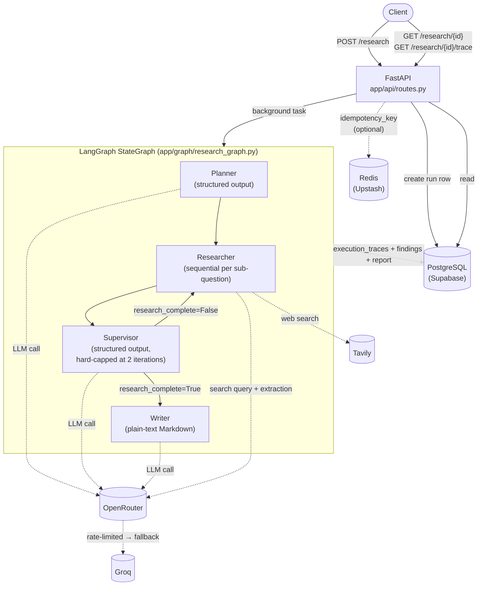

# Multi-Agent Research Assistant

An AI research system that takes a single natural-language question, breaks it into
focused sub-questions, gathers web-sourced evidence for each one, judges whether that
evidence is actually sufficient before writing anything, and only then produces a
cited Markdown report — all as four cooperating LLM agents orchestrated by a LangGraph
state machine, behind a FastAPI service with durable Postgres persistence and
per-run execution tracing. It exists to demonstrate (and actually enforce) the
difference between "an LLM that answers a question" and a system that plans its
research, checks its own work, and knows when to stop — with real guardrails around
cost, infinite loops, and third-party API failure, not just happy-path prompting.

## Architecture



Every node writes an `ExecutionTrace` row (tokens, latency, success/failure) and
accumulates `total_tokens_used` on the shared `ResearchState` as it runs, so the whole
pipeline's cost and behavior is inspectable after the fact via `GET /research/{id}/trace`
— not just its final output.

## Tech stack

| Choice | Why |
|---|---|
| **LangGraph** | Gives the Planner→Researcher→Supervisor loop→Writer flow explicit, testable state and conditional routing, instead of hand-rolled `if`/`while` orchestration around LLM calls. |
| **OpenRouter** (via the `openai` SDK) | One OpenAI-compatible API surface across many underlying model providers, so swapping the underlying model is a config change, not a code change. |
| **Groq** (automatic fallback) | A backstop when OpenRouter rate-limits mid-run — added after that happened for real during development — not the primary provider, since its own free-tier quota is tighter still. |
| **Tavily** | A search API purpose-built for LLM agents: returns clean `title`/`url`/`content` results instead of raw HTML to scrape. |
| **FastAPI** | Async-native, matching the app's async agent/DB code end-to-end, plus free OpenAPI docs at `/docs`. |
| **PostgreSQL (Supabase)** | Durable, relational system of record for runs, findings, reports, and execution traces — hosted so the container never needs a local database. |
| **Redis (Upstash)** | One narrow job: an atomic, short-TTL idempotency lock (`SET NX EX`) for repeat requests — a pattern Redis's semantics fit more directly than adding locking logic to Postgres for something this ephemeral. |
| **pytest** (+ `pytest-asyncio`, `pytest-cov`) | Async-aware test framework matching the codebase, with coverage reporting to catch untested error paths. |
| **Streamlit** | A minimal UI over the existing API for manually trying the system without `curl`/`/docs` — it's a plain HTTP client of `/research`, with no agent logic of its own, kept in its own image with its own small dependency set. |
| **Docker / Docker Compose** | Reproducible packaging for both services — the FastAPI app and the Streamlit frontend; Postgres and Redis stay external/hosted, so the compose file only ever needs these two. |

## Setup

### Prerequisites

- Python 3.12+ (the Docker image pins `python:3.12-slim`; no version was otherwise pinned in the project)
- A Supabase Postgres connection string and an Upstash (or any) Redis connection string
- API keys: [OpenRouter](https://openrouter.ai/), [Tavily](https://tavily.com/), optionally [Groq](https://groq.com/) for fallback

### Clone and configure

```bash
git clone <this-repo-url>
cd multi-ai-research-agent
cp .env.example .env
# then fill in .env with real values -- it is gitignored and never read by anything
# except this app itself; nothing in the repo or the Docker image bakes it in.
```

### Run locally (without Docker)

```bash
python -m venv .venv
source .venv/bin/activate        # or .venv\Scripts\activate on Windows
pip install -r requirements.txt

alembic upgrade head              # creates/updates research_runs, findings,
                                   # reports, execution_traces on your DATABASE_URL

uvicorn app.main:app --reload     # http://localhost:8000/docs
```

### Run with Docker Compose

Two services start together: `app` (the FastAPI backend) and `frontend` (a Streamlit
UI over it). The frontend talks to the backend over the compose network at
`http://app:8000` — not `localhost`, which inside a container means itself.

```bash
docker compose build
docker compose up
# API + docs:  http://localhost:8000/docs
# Frontend UI: http://localhost:8501

# Migrations are a one-off command, not run automatically on container start:
docker compose run --rm app alembic upgrade head
```

`.env` must exist locally with real values before either of the above — it's read via
`env_file` at container start and is excluded from the image by `.dockerignore`. It's
only needed by the `app` service; `frontend` only needs `API_BASE_URL`, which
docker-compose.yml already sets for the container-to-container case.

`depends_on: app` on the `frontend` service only orders container *start*, not API
*readiness* — `streamlit_app.py` retries its first request a few times with a short
delay to absorb the window where the API container is still starting up.

**If `DATABASE_URL` points at Supabase**, make sure it's the **Session Pooler**
connection string, not the direct `db.<project>.supabase.co` one — the direct host
resolves to IPv6, which Docker's default network can't route out over, and fails with
`OSError: [Errno 101] Network is unreachable` from inside the `app` container (it works
fine outside Docker, which is what makes this one confusing). See the comment next to
`DATABASE_URL` in `.env.example`.

### Run tests

```bash
pytest                                          # 82 tests
pytest --cov=app --cov-report=term-missing      # 99% coverage
```

Unit tests (`tests/unit/`) mock every external call (LLM, Tavily) and have no network
or database dependency. Integration tests (`tests/integration/`) use a real in-memory
SQLite database standing in for Postgres (same schema, different driver) to exercise
the DB layer without needing a live Supabase connection.

## API usage

### `POST /research` — start a research run

```bash
curl -X POST http://localhost:8000/research \
  -H "Content-Type: application/json" \
  -d '{"question": "What are the benefits and risks of remote work?"}'
```

```json
{
  "run_id": "171f4de0-73b1-45af-b921-c8299a1ae95f",
  "status": "pending"
}
```

The run executes in a background task; this returns immediately. An optional
`idempotency_key` field makes a repeated request with the same key return the
original `run_id` instead of starting a duplicate run.

### `GET /research/{run_id}` — check status / get the result

```bash
curl http://localhost:8000/research/171f4de0-73b1-45af-b921-c8299a1ae95f
```

```json
{
  "run_id": "171f4de0-73b1-45af-b921-c8299a1ae95f",
  "status": "completed",
  "question": "What are the benefits and risks of remote work?",
  "created_at": "2026-09-19T17:30:12.556348Z",
  "sub_questions": ["What are the benefits?", "What are the risks?"],
  "research_iterations": 1,
  "research_incomplete": false,
  "final_report": "## Introduction\n\n...",
  "error": null
}
```

`status` is one of `pending`, `running`, `completed`, or `failed` (with `error` populated).

### `GET /research/{run_id}/trace` — per-node execution trace

```bash
curl http://localhost:8000/research/171f4de0-73b1-45af-b921-c8299a1ae95f/trace
```

```json
{
  "run_id": "171f4de0-73b1-45af-b921-c8299a1ae95f",
  "status": "completed",
  "steps": [
    {
      "node_name": "planner",
      "input_tokens": 277,
      "output_tokens": 498,
      "latency_ms": 4435.9,
      "status": "success",
      "started_at": "2026-09-19T17:30:23.071439Z",
      "completed_at": "2026-09-19T17:30:27.507372Z",
      "error": null
    }
  ],
  "total_tokens_used": 8231,
  "budget_exceeded": false
}
```

## Key design decisions

**Why multi-agent instead of one LLM call.** Planning, evidence-gathering,
quality-gating, and writing are genuinely different jobs. A single prompt that both
searches and writes has no independent check on whether it actually found enough
before it starts drafting prose — splitting the Supervisor out as a distinct,
structured-output decision point is what makes "is this sufficient?" an explicit,
inspectable gate instead of an implicit assumption baked into one giant prompt.

**Why a Supervisor with a hard iteration cap (2).** The Supervisor's "is this
sufficient" judgment is itself an LLM call, which fails open (defaults to
`research_complete=True`) on error — but nothing stops an LLM from repeatedly deciding
"not sufficient yet" on a broad or unanswerable question. The hard cap guarantees the
loop terminates and cost stays bounded regardless of what the LLM decides; when the
cap forces completion, `research_incomplete=True` is set so the final report honestly
says so rather than silently presenting partial research as complete.

**Why a token budget (50,000) on top of the iteration cap.** The iteration cap bounds
loop *count*, but a single iteration with many sub-questions and large search results
can still be expensive on its own. The token budget is an independent circuit breaker:
the Researcher checks it before each sub-question and stops early if exceeded, and the
Writer checks it at start and still produces a best-effort report (with an honest note
about the cutoff) rather than failing outright. 50,000 is a reasonable first ceiling
for small/medium runs, not a deeply tuned number — it's meant to be revisited against
real usage.

**Why Redis for idempotency instead of just Postgres.** Postgres is the system of
record — durable, relational, needs to survive restarts and be queryable by status.
The idempotency lock is a different shape of problem: a short-TTL (24h), atomic
"has anyone claimed this key yet" check. Redis's `SET NX EX` maps directly onto that;
doing the same in Postgres would mean unique-constraint-and-catch-the-exception
gymnastics for something that's inherently ephemeral, not relational data worth
keeping.

**Why structured outputs for Planner/Supervisor but plain text for the Writer.** The
Planner's sub-questions and the Supervisor's boolean decision are consumed directly by
the graph's control flow — structured outputs (`response_format=<pydantic model>`)
guarantee that shape and eliminate an entire class of "the LLM almost returned valid
JSON" parsing bugs. The Writer's output is a long-form Markdown document for a human
reader; nothing downstream parses it beyond storing it as text, so forcing it into a
schema would fight the format for no benefit.

**Why Groq as an automatic fallback rather than the primary provider.** Groq was added
specifically as a backstop after OpenRouter's model rate-limited during real
development (see `PROBLEMS_AND_SOLUTIONS.md`). It isn't primary because its own
token-per-minute quota turned out to be tighter still — a large Supervisor prompt later
exceeded it too. It's a "better than nothing" secondary path, not a provider with
headroom to be primary.

## Known limitations

Documented honestly, not swept under the rug:

- **Narrow exception handling in `llm_client.py` for post-response errors.** `_create_completion()`
  wraps failures from the API call itself into `LLMCallError` consistently, but an
  unexpected-but-"successful" response shape (e.g. an empty `choices` list) is not
  uniformly guarded the same way — `generate_structured()`'s explicit `parsed is None`
  check is the main such guard; other unexpected shapes would surface as a raw,
  unwrapped exception rather than the app's own error type.
- **Agent nodes construct their own `LLMClient` and DB sessions internally** rather than
  receiving them via dependency injection — each node calls `LLMClient()` directly, and
  `record_node_trace()` opens its own session via `async_session_factory()`. This keeps
  nodes simple to call standalone (including in tests), but means nothing about those
  dependencies (pooling, reuse, test doubles) is swappable at the call site without
  patching module-level names.
- **Tavily has no shared exception base class**, unlike `openai.OpenAIError` — so
  `search_web()`'s retry logic catches the bare `Exception` type around the SDK call.
  This is a deliberate, documented trade-off, not an oversight, but it does mean a
  permanent error (bad API key) gets retried exactly like a transient one before
  failing.
- **The Researcher processes sub-questions sequentially, not in parallel.** Each
  sub-question's search-and-extract cycle is awaited one at a time in a loop rather
  than fanned out concurrently (e.g. via `asyncio.gather`). This was never actually
  implemented as parallel — total latency scales roughly linearly with sub-question
  count.
- **The Supervisor's prompt size was fixed (Milestone 15); the Writer's was not.**
  `generate_report()`'s prompt still includes full claim text, full snippets, and
  `source_url` per finding, unchanged — appropriate for accurate citations, but it will
  grow the same way the Supervisor's prompt did on a very large run with many
  accumulated findings. Not yet addressed.

See `PROBLEMS_AND_SOLUTIONS.md` for the real issues hit building this (including two
separate real-world LLM-provider rate-limit failures) and `INTERVIEW_PREP.md` for a
self-contained mock-interview study guide built from this project.
